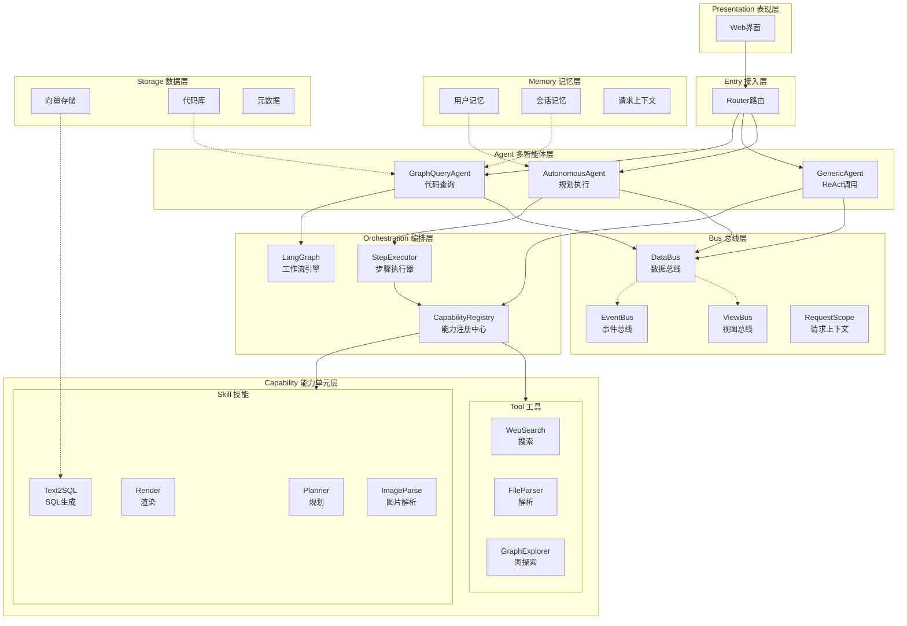
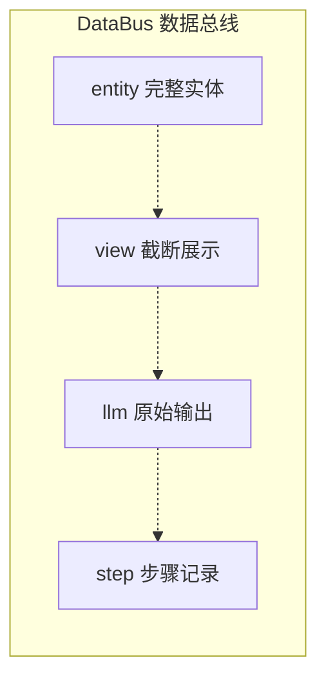

# CodeMind 系统架构 - Mermaid 分层架构图

## 架构总览



## 层次说明

| 层 | 职责 | 核心组件 |
|---|---|---|
| **表现层** | 用户交互、结果展示 | Web界面 |
| **接入层** | 请求路由、场景分发 | Router |
| **Agent层** | 三种智能体并行执行 | GraphQuery/Generic/Autonomous |
| **编排层** | 步骤调度、能力注册 | StepExecutor/LangGraph/CapRegistry |
| **能力层** | Skill/Tool能力单元 | Planner/Render/Text2SQL/... |
| **总线层** | 数据传递、事件传播 | DataBus/EventBus/ViewBus |
| **记忆层** | 用户/会话记忆管理 | UserMemory/SessionMemory |
| **数据层** | 持久化存储 | VectorDB/CodebaseDB |

## 总线机制



```mermaid
graph LR
    subgraph EventBus["EventBus 事件总线"]
        Pub[Publisher 发布者] --> Queue[事件队列]
        Queue --> Sub1[LogListener]
        Queue --> Sub2[MemoryListener]
        Queue --> Sub3[ProgressListener]
    end